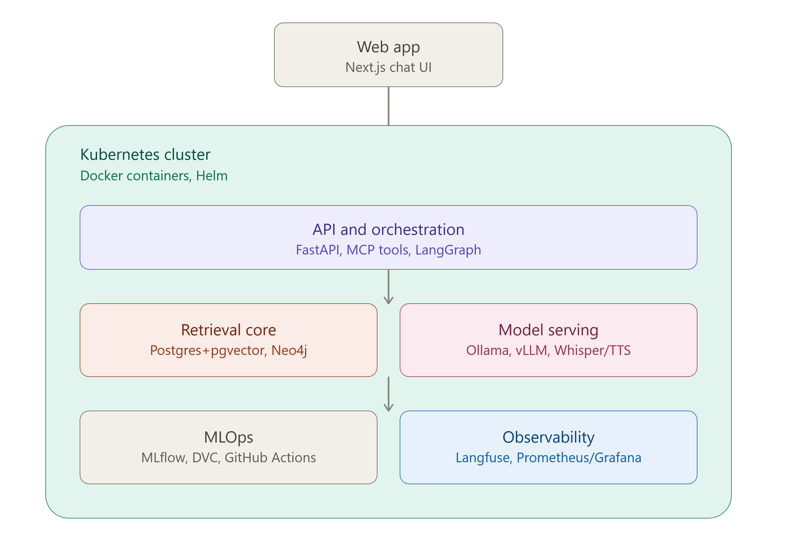

# Cruise Assistant

An end-to-end RAG chatbot for a cruise line's customer support use case - built to demonstrate RAG/GenAI, ML engineering, and MLOps/full-stack skills using real, messy, industry-sourced data.

**Status:** Working demo — retrieval, generation, and a chat UI run end-to-end locally. 
See [Architecture](#architecture) for what's built vs. designed.

## What it does

Ask questions about cabin types, booking policies, onboard venues, and shore excursions across five real ship documents — the assistant retrieves relevant passages from a vector database and generates a grounded answer, citing its sources. It won't answer questions outside its knowledge base.

## Architecture

Frontend (Next.js) → FastAPI → pgvector (dense retrieval) → Ollama (local LLM) → answer + sources

**What's built and running:**
- Ingestion pipeline for 11 real source documents (legal T&Cs, FAQs, excursions, ship technical sheets), each with a custom chunking strategy suited to its structure
- Embeddings (`sentence-transformers`) stored in Postgres/pgvector, with a flexible JSONB metadata column for heterogeneous chunk types
- FastAPI `/query` endpoint: vector search → LLM generation via Ollama, running entirely locally
- Two-layer guardrail against hallucination: a distance-threshold cutoff, and prompt-level grounding instructing the model to answer only from retrieved context
- Next.js chat frontend, connected end-to-end

**Designed, not yet implemented** (see [Roadmap](#roadmap)):
- Hybrid search (Elasticsearch sparse + pgvector dense)
- Reranking
- Knowledge graph (Neo4j) — containerized and running, not yet populated
- Multi-agent orchestration via LangGraph, MCP tool exposure
- Model routing (local vs. hosted LLM)
- RAGAS evaluation suite
- Kubernetes deployment, CI/CD, Langfuse/Prometheus observability

